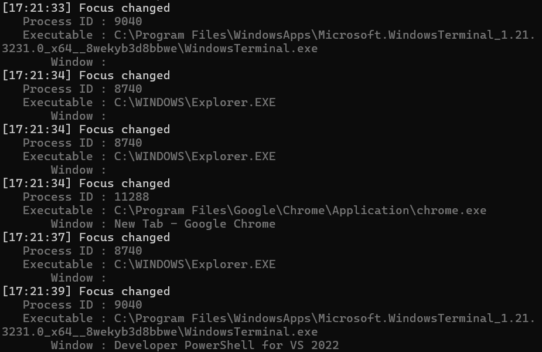

Earlier this week, my Windows 11 install began to exhibit a strange behavior: at random intervals, focus was being taken away from the application I was using. Keyboard pressed and mouse clicks would get sent to the desktop, and <kbd>Alt</kbd>+<kbd>Tab</kbd>bing would not return focus anywhere. In these moments, even Explorer was non-responsive. Interestingly, I found locking (<kbd>Win</kbd>+<kbd>L</kbd>) and unlocking the desktop would restore focus and make things interactable once again.

Some quick googling led me to Reddit threads of others experiencing the same issue, alleging it to be a Windows 11 bug. Some further googling, and I founder someone had made a tool to debug such an issue! Upon reviewing the code, though, I was dissapointed find it worked by continously polling `GetForegroundWindow`, a method which is both resource-intensive and possibly error-prone, as multiple focus changes that occur faster than the polling interval, for example, can not be reliably detected. Well, that's an enough of an excuse to open MSDN and make my own!

Before beginning, it is helpful to outline the two goals of this project:
1. To log whenever a focus change occurs, including information about which application is gaining focus
2. To use event listening, or install some hook, such that focus changes cannot be missed

To begin, my mind immediately turned to `SetWindowsHookEx`, a function which allows programs to install subroutines into an enumeration of Windows-defined message-handling procedures. Hooks installed this way are loaded into the address space of all running processes via a dynamic-linked library, or DLL, meaning the hook procedures are run within the context of the process they're in. If the goal is to log focus events, then some interprocess communication (IPC) is necessary between focused applications and the hooking one. Additionally, DLLs can only be loaded into processes with the same "bitness" ([Microsoft's own words](https://learn.microsoft.com/en-us/windows/win32/api/winuser/nf-winuser-setwindowshookexa?redirectedfrom=MSDN#remarks)), so Windows has a workaround: when trying to hook a 64-bit process with a 32-bit library, for example, an interprocess call back is created, and the hook is then run inside the context of the original hooking application.

These callbacks are orchestrated via the Windows messages, which is interesting for a few reasons. Firstly: it can be helpful to consider what the operating system itself does when trying to achieve the same thing. Secondly: why can't we just always delegate the responsibility of IPC to Windows, like in the mismatched "bitness" case? Unfortunately, there is no direct way to coerce this behavior out of `SetWindowsHookEx`.

> At this point, I just wanted something that worked, so I wrote [this]() using `SetWindowsHookEx` and named pipes for IPC, due to my familiarity with using them in the past.

It turns out, there is another way! `SetWinEventHook`, a higher level hooking API, hits both notes: First, there is an `EVENT_OBJECT_FOCUS` event to listen for, which fires exactly when it sounds like it would. Second, it allows the caller to explicitly specify whether to load the hook in the context of the process firing the event (dubbed an "in context" hook), or to only load it in the hooking process (an "out of context" hook) and do IPC magic on your behalf, so long as the process uses a Windows message loop.

> This "magic" is really just a combination of Windows messages and shared memory.

Using `SetWinEventHook`, the first two parameters are the min and max range of events to receive, in this case just `EVENT_OBJECT_FOCUS`. The next is a handle to the DLL containing the callback, however since we are using an "out of context" hook, it does not need to be specified. The fourth parameter is the callback function itself. The next two arguments are the IDs of the specific process and thread to listen to -- 0 indicates all. The last paramater is a flags value, which indicates whether to the hook ought to be used "in" or "out" of context, among other things.

After the hook is installed, the main thread must enter a message loop. Typically these event loops are used to handle user inputs in graphical applications, however one is required here as Windows messages are the IPC mechanism of use under the hood. By calling `GetMessage` and then `DispatchMethod`, execution blocks until a unit of work arrives, after which it is executed.

The program, then, can be distilled to the following:

```cpp
WINEVENTPROC handle_event; // forward declaration

int main() {
    auto hook = SetWinEventHook(
        EVENT_OBJECT_FOCUS, EVENT_OBJECT_FOCUS,
        NULL,
        handle_event,
        0,
        0,
        WINEVENT_OUTOFCONTEXT
    );

    MSG msg;
    while (GetMessage(&msg, NULL, 0, 0)) {
        DispatchMessage(&msg);
    }

    UnhookWinEvent(hook);
}
```

The callback function `handle_event` follows the `WINEVENTPROC` signature, and uses the handle to the focused window to get information about it before logging.

```cpp
void handle_event(
    HWINEVENTHOOK hWinEventHook,
    DWORD event,
    HWND hwnd, // handle to window being focused
    LONG idObject,
    LONG idChild,
    DWORD idEventThread,
    DWORD dwmsEventTime
) {
    auto info = get_info(hwnd);
    log_info(info);
}
```

Here, `get_info` finds the process's PID, opens a handle to it, and gets its name and other appropriate information. Then, `log_info` prints if beautifully. And, voila!



With a new tool at my disposal, it was time to finally investigate the cause of the strange focus bugs. You could not imagine my dissapointment to learn it was my mouse's configuration software misbehaving. Upon removing it, the problem went away, and seems(?) to have stayed away after a fresh install; an anti-climactic ending, I know. At least next time focus begins bugging out, I'll have just the right tool for the job.

The full source for this tool, dubbed FocusMonitor, is available [here](https://github.com/wlenig/focusmonitor) on GitHub.