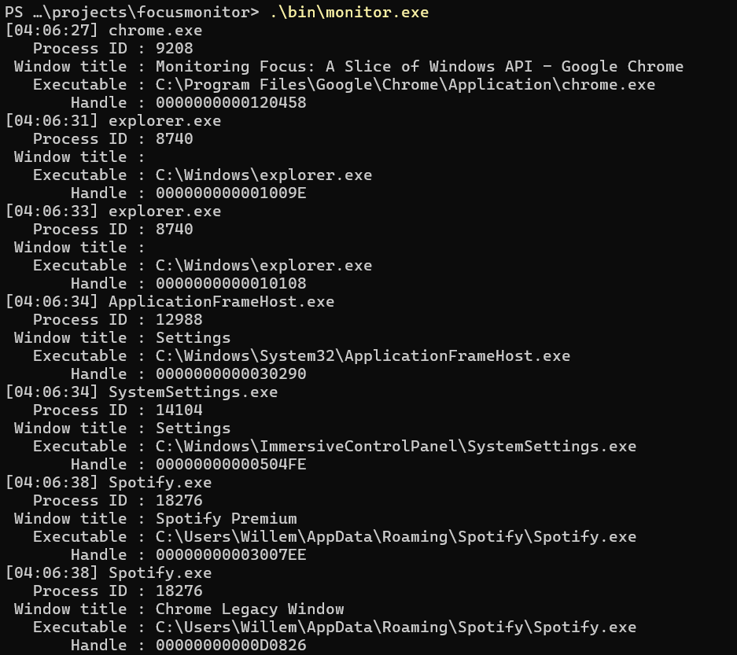

> **Note**: The formatting of the blog, more generally, is still incomplete. Please excuse any missing typographic features (such as bullet points) for the time being.

A week ago, focus on my Windows desktop began to spontaneously break: keyboard and mouse inputs would pass through windows straight to the desktop, Explorer would become utter unresponsive, and ocassionally a single process, like Chrome, would become the single interactable component in the system. Interestingly, quickly locking (<kbd>Win</kbd> + <kbd>L</kbd>) and unlocking the desktop would temporarily alleviate the issue.

When looking for a tool to debug the issue, particularly where the global focus was even going, I found someone had already made a [one](https://github.com/MoAlyousef/focusmon) to log changes in focus! Upon reviewing it, though, I was dissapointed to see it worked by constantly polling `GetForegroundWindow`, a method which is both resource intensive and also possibly error prone, as focus switches that happen faster than the polling interval, for example, can not be reliably detected. That was the justification I gave myself, at least, to stop looking for other tools, and sit down and write my own.

My first thought was to use `SetWindowsHookEx`, and installing a hook to `WndProc`, the function that processes inputs sent to a window. Upon reviewing MSDN, I was pleased to discover there is instead a hook for "computer-based training" applications, a politically correct term for student monitoring software. This hook, `WH_CBT`, is called whenever a window is created, destroyed, focused, or unfocused, and is perfect for this use case.

I should note: Using `SetWindowsHookEx` is rather precarious, as it maps the hooking DLL into the address space of every process in the system, a behavior neither anti-viruses or anti-cheats are fond of. Additionally, the callback itself gets called in the context of the process that triggered the hook, so some inter-process communication mechanism will be required to log anything. Nevertheless, I decided to give it a shot, using a named pipe to communicate.

The basic control flow of the program should then be:
```
1. Create a named pipe instance
2. Install the hook (only once!)
3. Accept a client, read and log the message
4. Repeat from step 1
```

In C++, this looks like:

```cpp
while (true) {
    auto pipe = create_instance();
    static auto hook = install_hook();
    accept_client(pipe)
}
```

First, we create a named pipe instance. We specify the flags `PIPE_TYPE_MESSAGE` and `PIPE_READMODE_MESSAGE` to ensure that messages are read atomically, and `PIPE_WAIT` to block the server until a client connects.

```cpp
auto create_instance() -> HANDLE
{
    auto instance = CreateNamedPipe(
        monitor::PIPE_NAME,
        PIPE_ACCESS_DUPLEX,
        PIPE_TYPE_MESSAGE | PIPE_READMODE_MESSAGE | PIPE_WAIT,
        PIPE_UNLIMITED_INSTANCES,
        monitor::BUFSIZE,
        monitor::BUFSIZE,
        0,
        NULL
    );

    if (instance == INVALID_HANDLE_VALUE) {
        throw std::runtime_error("Failed to create named pipe");
    }

    return instance;
}
```

To install the hook, we first need to load the DLL into memory. Then, we get the exported callback function, and install it using `SetWindowsHookEx`, specifying the hook ID as `WH_CBT`.

```cpp
auto install_hook() -> HHOOK
{
    auto monitor_module = LoadLibrary(L"monitor.dll");
    if (monitor_module == NULL) {
        throw std::runtime_error("Failed to load monitor module");
    }

    auto cbt_proc = (HOOKPROC)GetProcAddress(monitor_module, "CBTProc");
    if (!cbt_proc) {
        throw std::runtime_error("Failed to find callback function");
    }

    return SetWindowsHookEx(WH_CBT, cbt_proc, monitor_module, 0);
}
```

Accepting a client is straightforward: we wait for a connection, spawn a thread to read and log the message, and close the connection. Interestingly, `ConnectNamedPipe`, the function that waits for a client to connect, returns false in cases where the connection was succesful but the client was waiting. Thankfully, `GetLastError` will return `ERROR_PIPE_CONNECTED` in this case, indiating all is well.

```cpp
auto accept_client(HANDLE instance) -> void
{
    auto connected = ConnectNamedPipe(instance, NULL)
        ? TRUE
        : (GetLastError() == ERROR_PIPE_CONNECTED);
    
    if (!connected) {
        throw std::runtime_error("Failed to connect to named pipe");
    }
    
    DWORD thread_id;
    auto thread = CreateThread(
        NULL,
        0,
        handle_instance,
        instance,
        NULL,
        &thread_id
    );

    if (thread == NULL) {
        throw std::runtime_error("Failed to create thread");
    }

    CloseHandle(thread);
}
```

The thread function is simple: read the message, log it, and close the connection. Because we are using Windows' `CreateThread`, the function must adhere to the `LPTHRAD_START_ROUTINE` signature, which includes returning a `DWORD` and using the `WINAPI` (`__stdcall`) calling convention.

```cpp
auto WINAPI handle_instance(HANDLE instance) -> DWORD
{
    auto event = monitor::FocusEvent{};
    DWORD read;
    
    while (true) {
        if (ReadFile(
            instance,
            &event,
            sizeof(event),
            &read,
            NULL
        )) {
            log_focus_event(event);
        } else {
            break;
        }
    }

    CloseHandle(instance);
    return 0;
}
```

You may observe we are reading a `FocusEvent`, which is defined as follows:

```cpp
struct FocusEvent {
    char executable[MAX_PATH];
    char window_name[MAX_PATH];
    DWORD process_id;
};
```

Moving over to the DLL, or client side, the callback function needs to be defined following the `HOOKPROC` signature, and exported. Inside it, we check if signal code is `HCBT_SETFOCUS`, which indicates a window has gained focus, then write the event to the named pipe. In all cases, we continue the call chain. I should add that it is advised to do as little work inside the callback as possible, however seeing as this is a debugging tool, I found opening and writing to the pipes inside the hook acceptable.

```cpp
extern "C" __declspec(dllexport) LRESULT CALLBACK CBTProc(
  int    nCode,
  WPARAM wParam,
  LPARAM lParam
) {
    // wParam is handle to window gaining focus
    // lParam is handle to window losing focus

    if (nCode == HCBT_SETFOCUS) {
        write_event((HWND)wParam);
    }

    return CallNextHookEx(NULL, nCode, wParam, lParam);
}
```

For opening and writing to the pipe on the client, I define the following convenience functions:

```cpp
auto pipe_setup()
{
    auto pipe = CreateFile(
        monitor::PIPE_NAME,
        GENERIC_READ | GENERIC_WRITE,
        0,
        NULL,
        OPEN_EXISTING,
        0,
        NULL
    );

    return pipe;
}

auto pipe_write(HANDLE pipe, void* msg, size_t size)
{
    DWORD written;
    return WriteFile(
        pipe,
        msg,
        size,
        &written,
        NULL
    );
}

auto pipe_close(HANDLE pipe)
{
    return CloseHandle(pipe);
}
```

Then, sending a `FocusEvent` is as simple as filling the struct, and composing with the aforementioned convenience functions. `GetModuleFileName` with a `NULL` first parameter gets the executable file path, while `GetWindowText` gets the title of the focused window.

```cpp
auto write_event(HWND focused) -> void
{
    auto event = monitor::FocusEvent{};
    GetModuleFileNameA(NULL, event.executable, sizeof(event.executable));
    GetWindowTextA(focused, event.window_name, sizeof(event.window_name));
    event.process_id = GetCurrentProcessId();

    auto pipe = pipe_setup();
    pipe_write(pipe, &event, sizeof(event));
    pipe_close(pipe);
}
```

Now, we have a functioning log of the focus states! I've omitted the actual logging functions as they are not interesting, but the [full source](https://github.com/wlenig/focusmonitor/tree/master) can be found on GitHub. 



And with that, I found the culprit! My mouse manufacturer's was hijacking focus many hundreds of times per second, at seemingly random intervals. Oh well, I really liked my mouse, but I guess that's that. I am relieved, though, that it was not more directly Microsoft's fault, as I long dreaded upgrading to Windows 11, as this phenomenom began not shortly after.

While writing this blog post, I stumbled across a wildly simpler use of the Windows API that achieves essentially the same thing. See my next post for a run down of that, as well as an analysis of the pros and cons to each approach.
